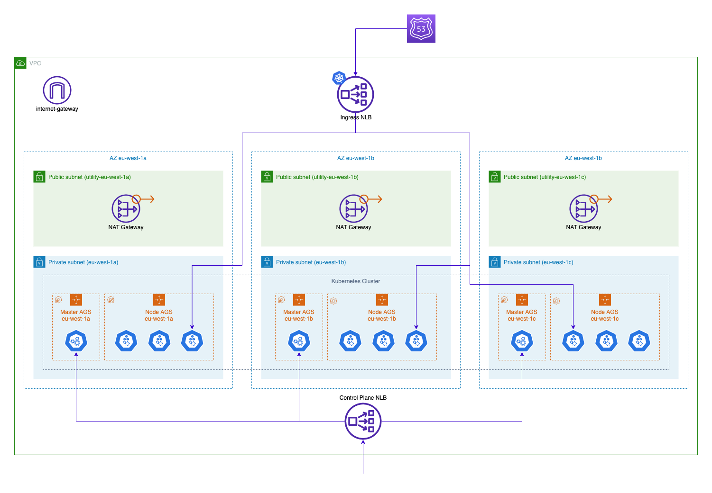

Kubernetes GitOps — Kops
==========================

Real world example of Kops deployment with 2 environments: lab and test.
Use [FluxCD](https://fluxcd.io/) to automatically deploy both infrastructure and applications.

## Architecture

The kubernetes cluster deploys on the three AZ of eu-west Region in a single VPC.
All instance groups are Spot Fleets that created nodes inside the private subnet.
All the nodes are running AL2 images and run on Graviton2 ARM instances.

A control-plane public NLB allow access to the Kubernetes API.
The front public NLB will be created using a Kubernetes Ingress resource.



Cilium is the CNI provider deployed in the cluster.

## Infrastructure

Kops enabled addons

|Name|Status|Comment|
|---|---|---|
|AWS IAM Authentication|✅| |
|AWS Load Balancer Controller|❌|A NLB will be created when deploying an Ingress|
|Cluster autoscaler|❌|Karpenter is used as a replacement|
|Cert Manager|❌|Deployed using FluxCD|
|Karpenter|✅|🚧 WIP|
|Metric Server|❌|Deployed using FluxCD & Prometheus Kube Stack|
|Node local DNS cache|✅| |
|Node termination handler|✅| |
|Node Problem Detector|✅| |
|Snapshot controller|❌| |
|FluxCD|✅|[Custom addon](https://github.com/glebiller/kops-flux-addon)|

## Getting started

🚧 Terraform to create Kops S3 state bucket

To start the cluster
```
make create
make update
```

To delete the cluster
```
make delete
```
